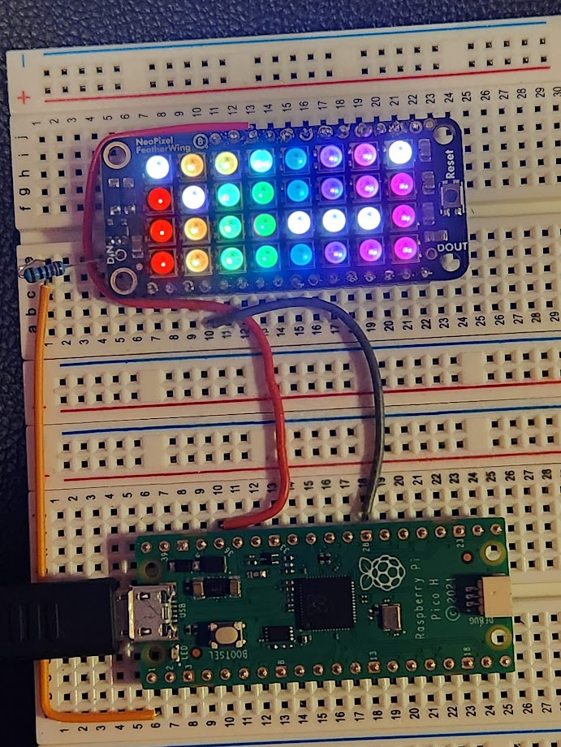

# Novice pico time w/ Jojess #

using blaz-r's lib: https://github.com/blaz-r/pi_pico_neopixel

## PicoH 2 NeoPixel - Pinout ##
* pico H 01         => resistor => neopixel_featherwing {DIN}
* pico H 40/VBUS/5v => neopixel_featherwing {VUSB}
* pico H 23/GND     => neopixel_featherwing {GND/dataGRNRef}

## PicoH 2 NeoPixel - Toy Scripts ##
* transflag.py  - trans flag marquee
* rainbow.py    - raainbow flag marquee
* jojessowo.py  - silly dots toy script
* rainbowsin.py - heartbeat over rainbow marquee

# Micropython Cheat Sheet #
## open pico micropython shell
* `mpremote`

## Pico H File System ##
* `mpremote fs`
   * `mpremote fs ls`
   * `mpremote fs rm :remotefile`
   * `mpremote cp localfile :remotefile`

## TODO ##
* basics 
** read up on autobooting scripts
** sin wave demo 
** data-in from PCM5102A DAC
* !!! basic-$!^@# music visualizer for C64 !!!  :3
