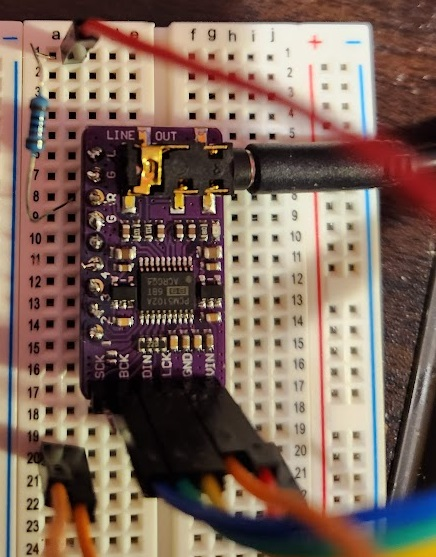

# Novice pico time w/ Jojess #

* I decided to make a music visualizer for my C64's PCM5102 DAC using a NeoPixel Featherwing and a Raspberry Pico.  It was easy!  ^///^
* Using [blaz-r's extended ws2812b lib](https://github.com/blaz-r/pi_pico_neopixel), which itself is based on [benevpi's](https://github.com/benevpi/pico_python_ws2812b) work.

* Please let me know what I'm doing wrong.  It does work tho.  <w< 

## Hardware list ##
* Raspberry Pico H 
* PCM5102A
* NeoPixel FeatherWing
* 2-3 x 360/400 pin breadboards
* 220 ohm resistor [maybe a good idea?]
* 10k ohm resistor [is this right?]
r* 220 ohm resistor 
* 6-7 wires ;p

## PicoH 2 NeoPixel - Cool Scripts ##
* pixldac.py - the purpose of this project.  audio <=> pico <=> neopixel, cute rainbow marquee equalizer :3

## PicoH 2 NeoPixel - Pinout ##
* pico H 01         => 220 ohm =>  IN4007 DIODE => neopixel_featherwing {DIN}
* pico H 40/VBUS/5v => neopixel_featherwing {VUSB}
* pico H 23/GND     <=> neopixel_featherwing {GND/dataGRNRef}

## PicoH 2 DAC - Pinin ##
* pico H 33 <============> PCM5102A DAC {GND}
* pico H 34 <= 10k ohm <= PCM5102A DAC {R}

## PicoH 2 NeoPixel - Toy Scripts ##
* transflag.py  - trans flag marquee
* rainbow.py    - raainbow flag marquee
* jojessowo.py  - silly dots toy script
* rainbowsin.py - heartbeat over rainbow marquee
* pintestanalog2digital.py - read analog audio for an "oscilloscope", print val to STDOUT

## Pico H File System ##
* `mpremote fs`
   * `mpremote fs ls`
   * `mpremote fs rm :remotefile`
   * `mpremote cp localfile :remotefile`

# LICENSE # 
* Anyone who uses this must awoo :3
* This project is available under the terms of [GPL 3.0](https://www.gnu.org/licenses/gpl-3.0) as described in [LICENSE](LICENSE)
   * more on [License: GPL v3](https://www.gnu.org/licenses/gpl-3.0)
* The included [neopixel.py](https://github.com/blaz-r/pi_pico_neopixel) library is Copyright (c) 2021 blaz-r and distributed under [the MIT License](https://opensource.org/licenses/MIT) as described in [LICENSE_MIT](LICENSE_MIT)
   * more on [License: MIT](https://opensource.org/licenses/MIT)